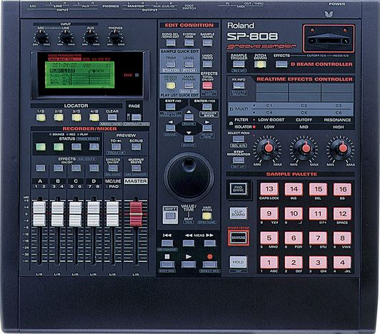
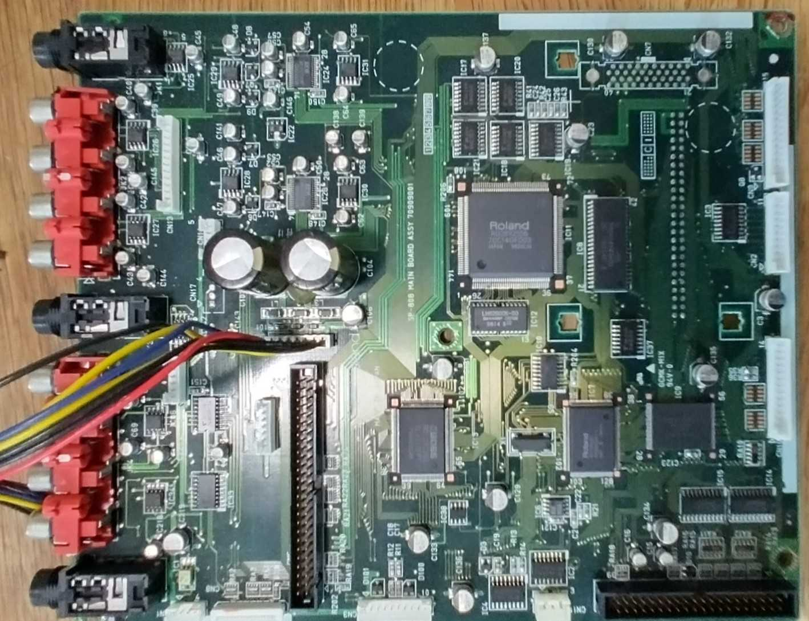

<div align="center">



# Roland SP‑808 / SP‑808EX — Reverse Engineering

**Teaching a 1998 Zip‑drive groovebox to speak to modern storage.**

Firmware, hardware and protocol analysis of the Roland SP‑808 / SP‑808EX — with the long‑term goal of
running CompactFlash, SD (via a CF adapter), ZuluIDE or an IDE HDD in place of the obsolete
Iomega ZIP‑100.


</div>

---

> ## ⚠️ NOT WORKING — DO NOT FLASH
>
> **No firmware modification in this repository is known to enable modern/internal storage on real
> hardware.** Any `*_LinkPlan_*` candidate image or MIDI update set here is an **untested experiment**
> (`runtime_validation: UNRESOLVED`) — *not* a release, and flashing it can brick your unit.
>
> The one thing that works today for real owners is **emulating a genuine ZIP‑100** — see the
> **🎛️ Using it today** section below.

---

## 📖 What this is

The SP‑808 (1998) was designed around an Iomega ZIP‑100 drive that is now obsolete, unreliable and hard
to source. The hardware is perfectly capable of driving a plain IDE device — the near‑identical
**Edirol A6** ships with HDD support — so the restriction is **purely firmware**.

This repo documents, from the ground up:

- the firmware for the Hitachi/Renesas **H8S/2653** MCU,
- the Epson/Roland **SLA919FF0J** IDE/ATAPI gate array and its bus traffic,
- the on‑disk **FAT** layout of SP‑808 Zip disks,
- and an ongoing attempt to **transplant the Edirol A6's native‑ATA HDD backend** into SP‑808 firmware.

> ### 🧭 Read first — evidence discipline
> This project deliberately separates **OBSERVED / STRONGLY INFERRED / HYPOTHESIZED / UNRESOLVED /
> SUPERSEDED** claims, and carries a lot of older, now‑corrected material. **Newer firmware/data‑flow
> reconstruction wins over inherited names and older prose.** Authoritative sources (newest dated):
>
> 📒 [Evidence Ledger](SP-808EX_Evidence_Ledger_2026-10-05_v11.md) ·
> 🏛️ [Architecture Reference](SP-808EX_Observed_Architecture_Technical_Reference_2026-10-05_v9.md) ·
> 🔧 [Hardware Corrections](Roland_SP-808_Hardware_Architecture_Corrections_2026-10-05_v4.md)
> &nbsp;|&nbsp; [`AGENTS.md`](AGENTS.md) (working rules) · [`CLAUDE.md`](CLAUDE.md) (working brief)
>
> Everything else — older revisions, `superseded/`, inherited IDA names — is a **lead, not a premise**.

---

## 📊 Status at a glance

| | Area | State |
|:--:|---|---|
| 🟢 | Firmware extraction (`rolandext.py`, decode) | Reproduces the stock image exactly (MD5 `d744a9cd…`) |
| 🟢 | IDA analysis of the H8S/2653 image | Working — see [`IDA/`](IDA/README.md) |
| 🟢 | On‑disk format | **Solved** — standard DOS/MBR + FAT (**FAT12 or FAT16**); extract with [`sp808_fat_extract.py`](Disks/Tools/sp808_fat_extract.py) |
| 🟢 | ZuluIDE emulating a ZIP‑100 (`zuluide.ini`) | **Tested working** (the maintainer's own config) — the practical drop‑in for owners |
| 🟡 | A6 native‑ATA transplant (**Link Plan v3**) | Candidate image + MIDI set generated & byte/payload‑verified; **hardware execution UNRESOLVED** |
| 🔴 | Firmware patch enabling internal HDD/CF | **Not demonstrated** |

---

## 🎛️ Using it today

You don't need a firmware mod at all — these are **known to work**:

1. **A genuine Iomega ZIP drive** — a **ZIP‑100**, or a **ZIP‑250** with the SP‑808**EX** firmware.
2. **ZuluIDE** with [`zuluide.ini`](zuluide.ini), emulating a ZIP‑100 (PIO 3, UDMA off, 512‑byte blocks,
   ZIP identity + `MODE SENSE` page `0x2F` spoof) — **tested working** by the maintainer; this is their
   own config. It presents the internal bay with something the stock firmware accepts as a real ZIP.

Enabling *arbitrary* IDE storage (a plain CF card or HDD) is still an open research goal — the A6
transplant — **not** a finished feature.

---

## 🔩 The hardware

<div align="center">

<br><em>SP‑808 main board — the H8S MCU, the SLA919FF0J IDE/ATAPI gate array, DRAM/flash and the 40‑pin ATA header.</em>
</div>

| Part | Detail |
|---|---|
| **MCU** | Hitachi/Renesas **H8S/2653** (`HD6432653BA11F`, H8S/2600 core), 20 MHz, advanced expanded mode. 64 KiB on‑chip ROM (`0x000000–0x00FFFF`), 1 KiB on‑chip RAM. 24‑bit address space. |
| **IDE/ATAPI** | Epson/Roland **SLA919FF0J** custom gate array (no public programming datasheet). |
| **Flash** | Sharp **LH28F800SUT‑70** — 8 Mbit = **1 MiB**; holds the H8 application image, mapped from `0x100000`. |
| **Storage (stock)** | Internal ATAPI **Iomega ZIP‑100**. |
| **Optional** | SP808‑OP1 external SCSI board (NCR53CF92) — a *separate* storage path. |

### Two storage paths — do not conflate them

- **Internal IDE/ATAPI** (the stock ZIP bay, via the SLA919FF0J): real ATA `PACKET` traffic — this is
  where a replacement CF/HDD/ZuluIDE actually sits. SP‑808 delegates it to opaque DRAM services
  (`0x400380 / 0x4003A8 / 0x4003AC`).
- **External SCSI** (optional SP808‑OP1): a target‑indexed SCSI‑style backend (`0x12Axxx`). This is
  where the explicit `IOMEGA`/`ZIP` identity gate lives — **patching it does not touch the internal
  drive.**

---

## 🧪 HDD enablement — Link Plan v3

The demonstrated route is that **Edirol A6 firmware drives an IDE HDD on SP‑808 hardware** via an
application‑resident native ATA backend. "Link Plan v3" transplants a **bounded, read‑only** slice of
that backend into SP flash: cold init → `EC` IDENTIFY → one `READ SECTORS` (LBA 0 → `0x5D0000`) → park
(no media writes, no mount/routing, normal SP operation not resumed).

**Verified — bytes only:** a [candidate image](firmware/SP8EXall_LinkPlan_v3_readonly_20261005T230456Z_23c5dcc8.bin)
and an [experimental MIDI deployment set](firmware/LinkPlan_v3_SMF_20261005T233407Z_977451bb/LinkPlan_v3_deployment.zip)
both reconstruct the same candidate — independently checked.

```text
Candidate image   MD5 9d38db7f4cc07f00c30c6022e073ed7d   (786,436 B / 0xC0004)
```

See the [design](analysis/Link_Plan_v3_2026-10-05.md), [verification report](analysis/SP8EXall_LinkPlan_v3_readonly_20261005T230456Z_23c5dcc8_verification.json)
and [SMF audit](analysis/Link_Plan_v3_SMF_audit_2026-10-06.md).

> ⚠️ **UNRESOLVED:** hardware updater acceptance and actual execution. **This is not a release — do not
> flash.** 🛠️ To repack a modified image, use the audited
> [`analysis/smf_v3_deployment_audit.py`](analysis/smf_v3_deployment_audit.py) — the older
> `firmware/bin2midi.py` and the `Bin2Mid.md` example emit malformed SMFs and must not be used.

---

## 🗂️ Repository map

```
├─ analysis/     Firmware RE: SZHC table, strings, Link Plan v2/v3, SMF audit, snapshot design
├─ protocols/    ATA/ATAPI & ZIP-drive references and full bus traces
├─ hardware/     CPU/flash/opcode references, datasheets, board notes
├─ Disks/        Disk-image & FAT analysis, CF compatibility, extraction tools
├─ firmware/     Firmware images, extraction/patch tools, candidate experiments
├─ scripts/      Host-side ATA IDENTIFY utilities
├─ IDA/          IDA Pro scripts & setup for the H8S/2653 image
├─ docs/ media/  Manuals and photos
└─ superseded/   Prior dated doc revisions — retained for audit trail, NOT current
```

The three authoritative dated docs plus `README.md`, `CLAUDE.md`, `AGENTS.md`, `TODO.md` and
`things.md` live in the repo root.

---

## 📚 Documentation

**Hardware** — [CPU & architecture](hardware/Roland_SP-808_CPU.md) ·
[flash](hardware/LH28F800SUT-70.md) · [notes & memory map](hardware/Roland_SP-808_Notes.md)

**Protocol** — [ATAPI reference](protocols/ATAPI.md) ·
[ZIP init](protocols/SP-808_and_ZIP_Drive.md) ·
[full IDE bus trace](protocols/Roland_SP-808_to_ZIP_Drive_sniff.md)

**Analysis** — [SZHC command table](analysis/SP-808_SZHC_CommandTableAnalysis.md) ·
[ZIP‑bypass study (mostly superseded)](analysis/RolandSP-808ZIPDriveValidationBypass.md) ·
[investigation findings](analysis/findings.md)

**Disks** — [demo‑disk / FAT structure](Disks/SP-808_Demo_Disk_Analysis.md) ·
[CompactFlash compatibility](Disks/CompactFlashCards.md) · [extraction tools](Disks/Tools/README.md)

**Firmware workflow** — [historical patch/convert notes](firmware/README.md)

---

## 🖥️ Reverse‑engineered boot splash

The SP‑808EX startup logo, reconstructed straight from the firmware's own ROM bitmaps:

<div align="center">

</div>

See [**exports/sp808_boot_logo/**](exports/sp808_boot_logo/README.md) for the individual recovered
sprites, their ROM offsets, the draw order, the startup animation and the bitmap format.

---

## 🙏 Credits & disclaimer

RDAC audio decoding: Randy Gordon's external `rdac` project. H8S documentation: Hitachi/Renesas.
Original SP‑808 design: Roland (no affiliation).

Not endorsed by Roland. Firmware modification can brick your unit; nothing here is a guaranteed fix,
and the firmware‑patch route in particular is unverified. **Use at your own risk, on hardware you own,
for preservation and personal use.**

**Resources:** [Owner's Manual](docs/SP-808_OM.pdf) ·
[Service Manual](Roland-SP-808-808-Pro-Service-Manual.pdf) ·
[Original discussion thread](https://forum.hddguru.com/viewtopic.php?f=13&t=31086)
